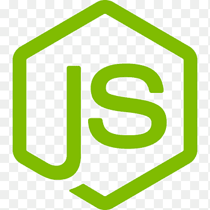

# Al salam alaikum, hi! | السلام عليكم .. أهلاً  

 

 

<h2>Who am I</h2>
<ul>
 <li><strong><em>I am Moaz Mohamed, a software engineer at Safecotech and a junior Computer Engineering student at Faculty of Engineering, Cairo University.</em><strong></li>
 <li><strong><em>I am a Back end web developer with Node.js, Express.js & Nest.js. </em></strong></li>
 <li><strong><em>I'm familiar with high level languages like C++, C#, Python, Java and JavaScript and low level languages like Assembly and hardware description languages like Verilog. </em></strong></li>
 <li><strong><em>I also like interacting with data and database, I'm familiar with Relational databases like MS SQL, MySQL, PostgreSQL, and SQLite, and with Non-relational databases like MongoDB. </em></strong></li>
 <li><strong><em>I was a Scouts leader at Faculty of Engineering, Cairo University Rovers Clan where I eliminated process bottlenecks, reviewing team activities and brought all new trainees up to speed quickly. </em></strong></li>
<li><strong><em>I'm also a Scouts leader at Fekra scouts and guidance group Where I track daily activities such as Art 
skills, scouting skills and person improvement for boys aged from 7 to 11 years. </em></strong></li>
<li><strong><em>I was a member at Faculty of Engineering, Cairo University Students Union where we helped students to improve their skills. </em></strong></li>

   

<h2 align="center">📫 How to reach me:</h2>

  

  

  

<h2 align="center">My Tech Toolbox 🧰</h2>

  

  

  

  

  

  

  

  
  
  
 
  
 
  
 
  
 
  
 
  
 
  
 
  
 
  
   
  

  

  

 
 
 
 
 
 
 
 
 
 

<h2 align="center">You can have a Look to my CV for more details from here:   </h2>

